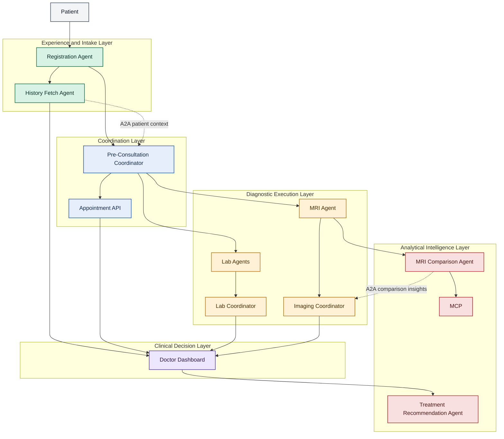
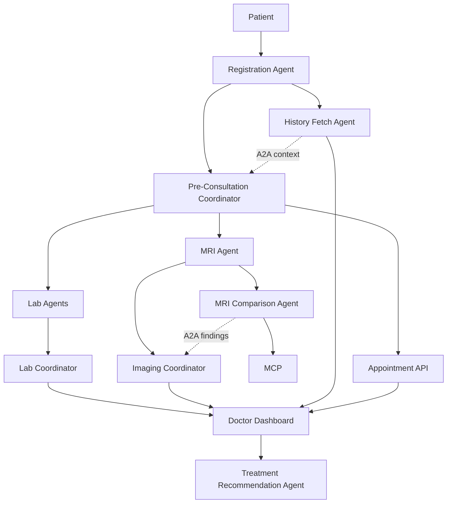
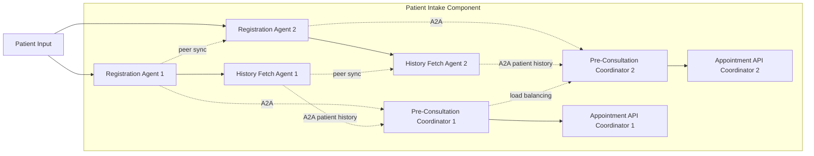
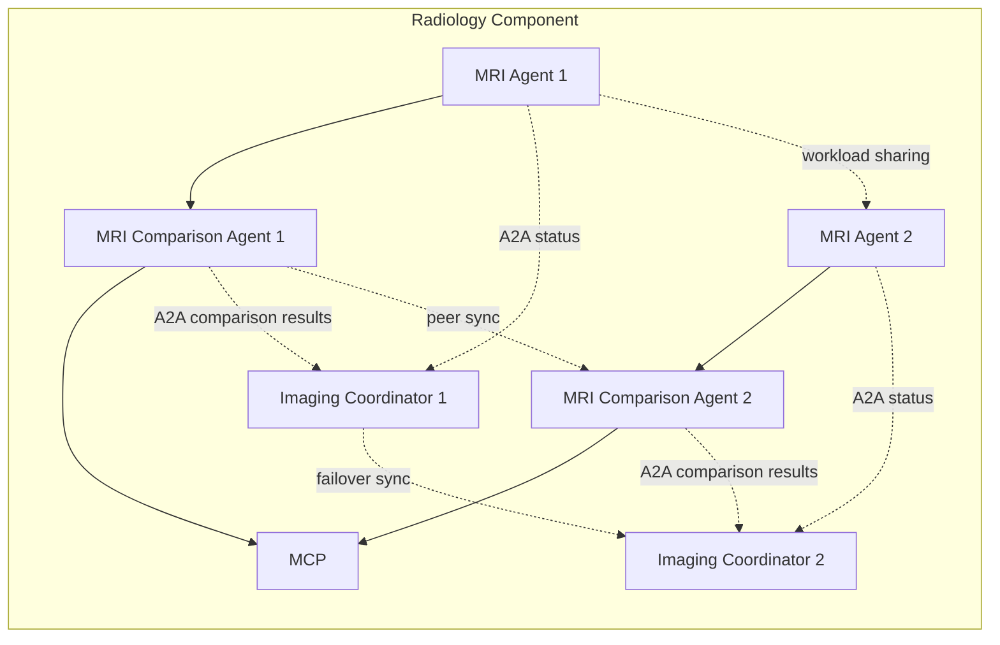
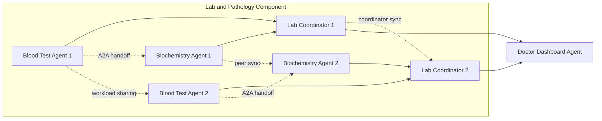

# MedSynapse: How Intelligent Agents are Revolutionizing Hospital Workflows

Hospitals do not fail because clinicians lack expertise. They fail operationally when the right information, the right specialist, and the right decision do not meet at the right time.

MedSynapse is a multi-agent AI system designed to change that reality. It coordinates intake, history retrieval, laboratory workflows, imaging analysis, and treatment support through a network of specialized agents that communicate through A2A patterns and invoke MCP for compute-heavy reasoning tasks. The goal is not to replace doctors or staff. The goal is to remove the friction that keeps them from operating at their best.

This article walks through the Phase 1 MedSynapse journey, the underlying agent architecture, and the design decisions that make the system practical for real hospital environments.

## The Problem Hospitals Keep Solving Manually

Meera arrives at a busy hospital at 8:10 a.m. with persistent chest discomfort and dizziness. Before she can see a doctor, she waits at registration while staff manually enter her details, confirm identity, and search across fragmented systems for prior visits. Her historical lab reports are stored in one system, imaging in another, and consultation notes in yet another location.

Once she is checked in, the next delays begin. A nurse requests blood work. A technician schedules imaging. A front-desk operator calls another department to confirm availability. Meanwhile, the doctor still does not have a unified view of Meera's history, prior scans, current symptoms, and pending diagnostics. Every department is working hard, but each one is working in sequence, with handoffs that depend on people remembering what needs to happen next.

By the time Meera reaches the consultation room, her care context is still incomplete. The physician must manually reconcile historical records, current vitals, new lab findings, and imaging updates. This is where hospital time disappears: not in medicine itself, but in coordination.

The core problem is simple and structural:

> Hospitals lack a scalable, intelligent system to coordinate patient care across departments, leverage historical data, and automate workflow without bottlenecks.

## MedSynapse in One Sentence

MedSynapse is a hospital workflow intelligence layer where specialized AI agents manage parallel tasks, share context through A2A communication, and use MCP services for deep historical comparison and analytical reasoning.

## Phase 1 Patient Journey

Phase 1 focuses on the most operationally painful part of the hospital experience: the journey from registration to doctor consultation.

### 1. Patient Registration

The patient enters the system through a Registration Agent that captures demographics, symptoms, identifiers, and visit metadata. The agent immediately creates a Patient Session ID that becomes the traceable context key for every downstream interaction.

### 2. History Fetch

As soon as registration is complete, a History Fetch Agent starts retrieving prior consultations, earlier lab records, historical imaging, and known clinical patterns associated with the patient. This happens in parallel with the next operational steps rather than waiting for someone to request it manually.

### 3. Pre-Consultation Coordination

A Pre-Consultation Coordinator evaluates the case context and determines what should happen before the doctor sees the patient. That may include booking a slot through the Appointment API, alerting the lab pipeline, or preparing imaging coordination for suspected conditions.

### 4. Lab Tests and Imaging

Lab Agents and MRI Agents operate as specialized workers. A Lab Coordinator aggregates pathology outputs, while an Imaging Coordinator manages radiology execution and routes historical scan comparisons to MCP through the MRI Comparison Agent.

### 5. Doctor Consultation

Instead of receiving fragmented updates, the doctor sees a unified dashboard that combines patient history, pre-consultation outcomes, new lab findings, imaging observations, and pending items.

### 6. Treatment Recommendation

Finally, a Treatment Recommendation Agent synthesizes structured findings and supports the physician with a recommendation layer that is context-aware, traceable, and grounded in the complete patient session.

## Visual High-Level Design

The diagram below shows MedSynapse as a layered hospital workflow system. It highlights how patient intake, orchestration, diagnostics, and doctor-facing decision support are connected through A2A coordination, while MCP is reserved for deeper comparison and compute-intensive reasoning.

## High-Level Flow

This Phase 1 flow is deliberately modular. Each agent handles a bounded responsibility, and the patient session moves forward through coordinated, asynchronous updates rather than human-driven polling.

## Component-Level Architecture

### Patient Intake Component

The intake layer is built for burst traffic. Instead of relying on a single workflow service, MedSynapse can run multiple instances of registration, history, and coordination agents to absorb spikes in patient arrivals.

### Radiology Component

Radiology workflows often require both orchestration and heavier reasoning. MedSynapse keeps acquisition and comparison separate so that each part can scale independently.

### Lab and Pathology Component

The lab stack is optimized for parallel execution and structured aggregation before the physician ever opens the chart.

## Why the Architecture Works

MedSynapse is not just a collection of agents. It is a division-of-responsibility model designed for hospital throughput, resilience, and clinical usability.

### Multi-Instance Agents for Scalability

- Registration spikes are real in outpatient and emergency settings. Running multiple instances of the Registration Agent and related coordinators prevents a single queue from becoming the system bottleneck.
- Imaging and lab demand can vary by hour, specialty, or season. Multi-instance agent pools allow the system to distribute work across equivalent workers without redesigning the workflow.
- Example: if 40 patients arrive in a compressed morning window, two or more intake agents can process sessions in parallel while downstream coordinators keep pace.

### Session Management with Patient Session ID

- Every patient interaction is tied to a Patient Session ID created at intake.
- The Session ID allows agents across departments to reference the same patient journey without ambiguity.
- It also improves observability. When something is delayed, the hospital can inspect exactly which agent, handoff, or department is waiting on the session.
- Example: the doctor dashboard can reconcile historical MRI comparisons, current blood tests, and appointment coordination because all outputs point to the same session context.

### Asynchronous Communication with A2A

- A2A communication ensures agents do not need to block each other to make progress.
- History retrieval can happen while appointment orchestration is running. Lab coordination can proceed while imaging comparison is still being computed.
- This matters in hospitals because sequential workflows create avoidable waiting time even when departments are available.
- Example: the Pre-Consultation Coordinator can dispatch lab and imaging requests immediately after enough intake context is available, rather than waiting for every historical artifact to finish loading.

### MCP for Heavy Compute Comparisons

- Not every task belongs inside an agent. Some tasks are compute-intensive, comparison-heavy, or better handled by specialized reasoning services.
- MedSynapse uses MCP where deep analysis is required, such as comparing current MRI findings against historical scans or consolidating multiple data modalities.
- This keeps operational agents lightweight and responsive while offloading advanced inference to dedicated compute pathways.
- Example: the MRI Comparison Agent can call MCP for longitudinal comparison across prior scans without turning the core imaging coordinator into a monolithic analysis engine.

### Non-Overlapping Agent Responsibilities

- Each agent has a narrow, explicit scope.
- Registration agents capture intake. History agents retrieve context. Coordinators orchestrate. Comparison agents analyze. Dashboard agents present. Recommendation agents synthesize.
- This separation reduces duplicated logic, simplifies auditing, and makes failures easier to isolate.
- Example: if a lab result is delayed, the issue can be traced to the lab pathway without questioning whether the intake agent or doctor dashboard owns that responsibility.

## Design Decisions That Matter in Hospitals

Several architectural choices are deliberate responses to real operational constraints.

### Parallelism Over Sequential Queues

Traditional hospital software often mirrors administrative silos. MedSynapse instead models the patient journey as a graph of parallelizable tasks. That reduces idle time between departments and compresses the path to clinical decision-making.

### Coordination Before Intelligence Theater

Many AI systems focus first on prediction. MedSynapse focuses first on coordination. In hospital operations, removing handoff friction often creates more value than adding another isolated model output.

### Traceability as a First-Class Requirement

Clinical environments need visibility. Every agent action, handoff, and MCP invocation should be attributable to a patient session and operational event. This is essential for safety, debugging, and institutional trust.

### Specialized Agents Instead of One Super-Agent

A single general-purpose agent might sound elegant, but it becomes hard to govern, scale, and validate. MedSynapse uses a society of specialized agents because hospitals need predictable behavior under load, not only flexible reasoning in demos.

## Real-World Impact

If implemented well, MedSynapse changes both the patient experience and the economics of care delivery.

### Patient Benefits

- Faster registration because intake agents can scale horizontally during peak hours.
- Reduced waiting because labs, imaging, and history retrieval can begin in parallel.
- A more seamless journey because patients do not need to repeatedly restate history across counters and departments.
- Better-informed consultations because the doctor sees integrated findings instead of scattered partial records.

### Hospital Benefits

- Better resource allocation because coordinators can dispatch work based on availability instead of phone calls and manual follow-up.
- Fewer avoidable delays because agents continue progressing tasks asynchronously.
- Reduced operational error because structured handoffs replace ad hoc relays.
- Higher clinician efficiency because the dashboard concentrates context before the consultation starts.

### Illustrative Operational Example

In a hospital handling 300 outpatient visits per day, saving even 8 to 12 minutes of coordination time per patient can recover 40 to 60 staff hours daily across registration, diagnostics, and consultation preparation. The exact number will vary by institution, but the operational leverage is substantial because coordination waste compounds at scale.

The larger effect is qualitative: fewer bottlenecks, fewer repeated questions, fewer missed follow-ups, and more confidence that the next action in a patient journey is already in motion.

## Future Vision

Phase 1 proves the workflow pattern. The longer-term vision is much broader.

- Pharmacy agents can validate medication availability, interaction risks, and fulfillment timing.
- Billing agents can prepare claims and pre-authorizations without interrupting clinical flow.
- Surgery agents can coordinate pre-op readiness, diagnostics completion, and post-op tracking.
- Telemedicine agents can connect remote consultations into the same patient session fabric.
- Predictive analytics can identify deterioration risk, likely no-shows, and care escalation signals before delays become clinical problems.
- Multi-modal MCP can combine MRI, lab values, ECG traces, pathology, and even genomics into richer comparison pipelines.
- Patient-facing agents can extend MedSynapse beyond the hospital, supporting home monitoring, medication reminders, and follow-up triage.

The important point is realism. This vision does not require one giant leap to autonomous healthcare. It requires building reliable agent layers department by department, each one adding measurable operational value.

## Why MedSynapse Matters Now

Hospitals already have data. They already have staff. They already have systems. What they often lack is a coordination fabric that can turn fragmented activity into a coherent patient journey.

MedSynapse addresses that gap with a practical architecture:

- specialized agents instead of one overloaded workflow engine
- A2A communication instead of rigid sequential handoffs
- MCP for deep analytical tasks instead of forcing every agent to do everything
- a doctor-facing synthesis layer that turns parallel workflows into actionable clinical context

## Conclusion

Phase 1 of MedSynapse completes a meaningful story: the patient registers once, historical context is fetched automatically, lab and imaging pathways are coordinated in parallel, and the doctor receives a unified dashboard before making a decision. That is already a significant shift from the fragmented workflows many hospitals still operate today.

The system's strength comes from its architecture. Scalable agents handle operational load. A2A patterns keep work moving across departments. MCP enables historical comparison and deeper reasoning where it actually matters. The result is a hospital workflow that is faster, more connected, and more clinically useful.

Imagine a hospital where every agent works in sync, patient care is seamless, and historical insights are just a click away. That is the direction MedSynapse points toward.