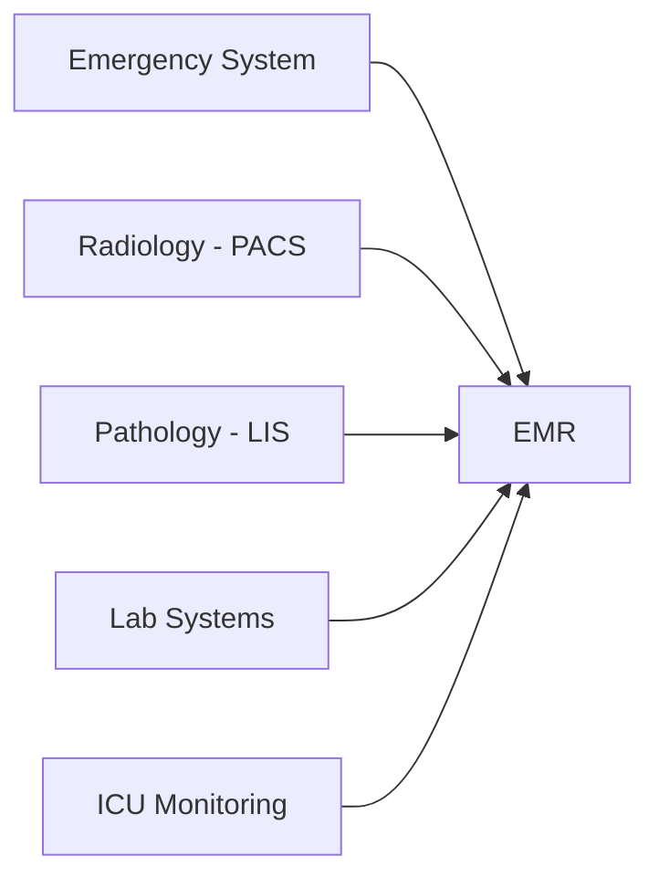

# The Broken Operating System of Modern Hospitals: Why Healthcare Needs an Intelligence Layer

## 1. Opening Hook: A Real-World Hospital Journey

It’s 7:45 a.m. when Priya, a 54-year-old woman, walks into a major city hospital with shortness of breath and chest pain. She’s anxious, clutching her previous discharge summary and a folder of lab reports. At the Emergency Room (ER) desk, a nurse asks for her details—again. Priya spells out her name, date of birth, and insurance number, just as she did last month.

She’s triaged and sent for an ECG. The technician, unable to access her prior results, repeats the test. The ER doctor, pressed for time, reviews the ECG and orders blood work. Priya is wheeled to Radiology for a chest X-ray. The radiologist, seeing only today’s order, has no context of her last scan. Meanwhile, the lab technician draws blood, but the system doesn’t flag that Priya’s potassium levels have been trending upward for weeks.

Hours pass. Reports trickle in—one in the ER system, another in the Radiology PACS, a third in the Lab Information System. The ER doctor, juggling multiple logins and paper printouts, tries to piece together Priya’s story. A specialist is called, but by the time he arrives, Priya’s care context is still fragmented. The cycle of repeated data entry, disconnected reports, and missed insights continues.

This is not a failure of medicine. It’s a failure of the hospital’s operating system.

---

## 2. The Hidden Complexity of Hospitals

Modern hospitals are technological marvels, but beneath the surface lies a web of specialized systems:

- **Electronic Medical Records (EMR/EHR):** The digital backbone for patient history, medications, and clinical notes.
- **Radiology PACS:** Manages imaging studies—X-rays, CTs, MRIs—often siloed from other data.
- **Pathology LIS:** Handles biopsy results, tissue analysis, and pathology workflows.
- **Lab Information Systems:** Tracks blood work, chemistry panels, and microbiology.
- **ICU Monitoring Systems:** Streams real-time vitals, alarms, and device data.

Each system is optimized for its domain. The EMR is robust for documentation. PACS excels at image storage and retrieval. The LIS is tailored for specimen tracking. ICU monitors are engineered for second-by-second reliability.

But there is no unified intelligence. Each system is an island, working well individually but blind to the broader clinical context.

---

## 3. The Fragmentation Problem

On paper, these systems are “integrated.” Data flows into the EMR. Reports are attached. But this is integration at the data level, not at the intelligence or reasoning level.

- The EMR stores the radiology report, but cannot correlate it with lab trends.
- The LIS uploads lab results, but cannot flag when imaging and labs together suggest a new diagnosis.
- ICU monitors stream data, but the system cannot reason about changes in context.

The result: a patchwork of data, not a fabric of intelligence.

---

## 4. The Doctor’s Reality

For clinicians, this fragmentation is not abstract—it’s a daily struggle:

- **Multiple Logins:** Doctors juggle passwords for the EMR, PACS, LIS, and more.
- **Separate Reports:** Each system generates its own report, often in incompatible formats.
- **Manual Correlation:** Physicians must mentally connect the dots—matching lab values to imaging findings, cross-referencing notes, and recalling patient history.
- **Cognitive Overload:** Under time pressure, even the best clinicians can miss subtle patterns or trends.

A real-world example: Dr. Rao, a cardiologist, spends 30% of his shift logging into different systems, searching for prior echocardiograms, and reconciling medication lists. He’s not alone—studies show that clinicians spend more time on data retrieval than on direct patient care.

---

## 5. The Missing Layer: Intelligence Over Time

What’s missing is not more data, but more intelligence—especially intelligence that operates over time.

- **No Automatic Patient History Reasoning:** Systems do not synthesize a patient’s longitudinal story.
- **No Trend Detection:** Lab values that drift upward over weeks go unnoticed.
- **No Proactive Alerts:** Imaging changes are not automatically compared to prior studies; subtle deteriorations are missed.

**Example:**  
A patient’s creatinine rises slowly over three admissions. Each lab result is “normal” in isolation, but the trend signals early kidney dysfunction. No system flags this. The burden falls on the doctor to remember, review, and connect the dots—often under time constraints.

Another example:  
A radiologist notes a “small nodule” on a lung CT. Six months later, a new scan is performed, but the system does not automatically compare the images or alert the clinician to subtle growth. The opportunity for early intervention is lost.

---

## 6. The Patient Experience Gap

For patients, the fragmentation is palpable:

- **Manual Report Carrying:** Patients like Priya become couriers, shuttling paper reports and CDs between departments.
- **No Unified Explanation:** Each specialist provides a piece of the puzzle, but no one offers a holistic view.
- **No Continuous Care Intelligence:** After discharge, there is no system that “remembers” the patient’s journey, flags risks, or coordinates follow-up.

**Example:**  
A diabetic patient is discharged with instructions to follow up in two weeks. The EMR records the visit, but no system tracks whether the patient’s blood sugar trends are worsening, or whether a follow-up actually occurs.

---

## 7. Why Traditional AI Has Not Solved This

AI is not new to hospitals. But so far, it has been deployed as isolated tools:

- **Isolated Algorithms:** AI reads X-rays, predicts sepsis, or flags abnormal labs—but each tool operates in a silo.
- **No Orchestration:** There is no system to coordinate AI outputs across workflows.
- **No Workflow Awareness:** AI does not “know” where the patient is in their journey, or what decisions are pending.
- **No Decision-Level Intelligence:** AI suggests, but does not reason, collaborate, or automate across systems.

The result: AI as a collection of point solutions, not as an operating layer.

---

## 8. The Real Problem Statement

> “Modern hospitals have systems of record, but not systems of intelligence.”

This is the crux of the issue:

- **No Reasoning Across Systems:** Data is stored, but not synthesized.
- **No Automation of Decision Flows:** Every handoff, escalation, and follow-up is manual.
- **No Contextual Awareness:** Systems do not “understand” the patient’s journey, risks, or care context.

Hospitals are running on an operating system designed for documentation, not for intelligence.

---

## 9. What an Ideal Future Looks Like (Teaser)

Imagine a hospital where:

- A unified patient intelligence layer continuously monitors all data streams—labs, imaging, notes, vitals.
- Automated insights are generated in real time, flagging trends, risks, and opportunities for intervention.
- Context-aware decision support guides clinicians, not just with data, but with synthesized, actionable intelligence.

This is not just a better dashboard. It’s a new paradigm—where software does not just store data, but actively reasons, collaborates, and assists in care delivery.

---

## 10. Closing + Transition

The operating system of modern hospitals is broken—not because of a lack of technology, but because of a lack of intelligence. The future of healthcare demands more than systems of record; it demands systems of reasoning.

In the next blog, we will explore how Agentic AI systems introduce a new operating model for hospitals—where software does not just store data, but actively reasons, collaborates, and assists in care delivery.

---

This blog is crafted to set the stage for a series on the transformation of hospital workflows through intelligence layers, blending real-world stories with deep technical and business insight.
