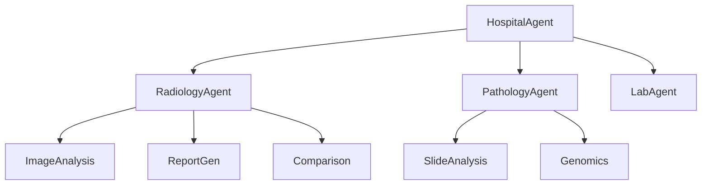

# From Systems to Intelligence: Designing Agentic AI for Modern Hospitals

## 1. Opening: From Passive Systems to Active Intelligence

In the first MedSynapse blog, we described the structural problem inside modern hospitals: the core systems are built to store records, route transactions, and preserve compliance, but not to reason across time, departments, and changing clinical context. Electronic medical records, radiology systems, pathology workflows, lab platforms, and ICU monitoring tools each perform critical functions. Yet the burden of connecting them still sits with clinicians, coordinators, and patients.

That design model made sense when hospital software was primarily administrative. It breaks down when care delivery depends on synthesizing signals across dozens of systems, rapidly, repeatedly, and under operational stress.

Hospitals now need systems that do not just store data, but actively reason and collaborate.

That shift is what makes Agentic AI important. Not because hospitals need more chat interfaces, and not because every workflow requires an autonomous model, but because healthcare increasingly requires software components that can understand context, pursue a goal, invoke the right tools, coordinate with peers, and produce useful work inside real operational pathways.

This is where the idea of the agent becomes practical. In a hospital, an agent is not a marketing label. It is a design unit for distributed intelligence.

If the previous generation of healthcare platforms gave hospitals systems of record, the next generation must provide systems of coordinated intelligence. The right way to build that intelligence is not as a single monolithic model, but as a network of specialized agents aligned to the way hospitals actually operate.

## 2. What Is an Agent in a Hospital System?

In healthcare architecture, the term agent should be used carefully. An agent is not just an LLM wrapped in an API. It is a goal-driven, context-aware software unit that can take responsibility for a bounded clinical or operational function.

That distinction matters. A general-purpose model can generate text. A hospital agent must do more than generate. It must work reliably inside a controlled environment with clear inputs, clear outputs, explicit permissions, and operational accountability.

At a minimum, a useful hospital agent has four capabilities:

- It can understand domain data, whether that data comes from structured fields, reports, time-series streams, or images.
- It can make bounded decisions, such as determining what information is missing, what downstream task should be triggered, or what summary should be produced.
- It can use tools through a controlled access layer such as MCP to fetch records, call models, run comparisons, or retrieve prior exams.
- It can communicate with other agents using structured agent-to-agent messages instead of embedding all logic in one place.

This combination turns an agent into an execution boundary. Instead of building one large application that tries to know everything about every department, architects can assign focused intelligence to the place where it belongs.

Consider a radiology workflow. The system does not need one generic AI component that tries to interpret scans, write reports, compare priors, and summarize oncology implications in a single pass. It needs a radiology-specific set of capabilities that can be coordinated and audited. That is the difference between using AI as a feature and designing intelligence as an architecture.

Another way to think about it is this: traditional hospital software answers, “Where is the data?” Agentic hospital software answers, “What needs to happen next, given this context?”

## 3. Designing Agents by Department

The most practical design principle for agentic healthcare systems is simple: structure agents the same way hospitals are structured.

Hospitals are already organized around domains with distinct workflows, data types, turnaround expectations, escalation paths, and clinical responsibilities. Radiology does not behave like pathology. ICU monitoring does not behave like outpatient labs. Trying to force these workflows into one generic intelligence service usually creates an opaque system with unclear ownership and poor extensibility.

Department-aligned agents solve this by matching software boundaries to operational reality.

### 3.1 Radiology Department Agents

Radiology is an ideal place to see why specialized agents matter. It is not one task. It is a chain of tasks that starts with imaging data and ends with clinical action.

#### Radiology Orchestrator Agent

The Radiology Orchestrator Agent coordinates the full radiology workflow for a given case. It decides which sub-agents need to participate, in what order, and with what context. It is not responsible for doing all the work itself. Its purpose is control, routing, and state management.

For example, when a patient arrives in the emergency department with suspected stroke, the radiology orchestrator receives the imaging request, determines that the case is high priority, invokes image analysis for the CT scan, requests comparison with prior brain imaging if available, triggers structured report generation, and sends a condensed result to downstream care agents.

This matters because radiology work is rarely linear. The orchestrator ensures that specialized steps happen consistently without embedding brittle routing logic into every downstream service.

#### Image Analysis Agent

The Image Analysis Agent is responsible for detecting abnormalities and extracting clinically useful features from imaging studies. Depending on the modality, it may call one or more domain-specific inference tools for CT, MRI, ultrasound, X-ray, or mammography.

Its purpose is not to replace the radiologist. Its purpose is to create a first-pass machine interpretation layer that can accelerate triage, highlight suspicious regions, and normalize extracted findings into structured outputs.

A realistic example is chest CT triage. The image analysis agent identifies a suspicious pulmonary nodule, records its location and approximate volume, tags the study for expedited review, and passes a structured payload to the next agent. That gives the radiologist a focused starting point rather than a blank screen.

#### Report Generation Agent

The Report Generation Agent converts findings into structured, clinically usable language. It takes outputs from image analysis, modality metadata, relevant priors, and radiologist notes, then produces a report draft in the institution's preferred format.

Its purpose is consistency and speed. Radiology reporting is not only about prose. It is about reproducible sections, standardized terminology, and minimizing ambiguity for downstream physicians.

A common use case is musculoskeletal MRI. The report generation agent can draft sections for ligament integrity, marrow signal, joint effusion, and impression while preserving the radiologist's ability to edit and finalize. That reduces documentation friction without removing physician oversight.

#### Comparison Agent

The Comparison Agent looks across prior studies to determine progression, stability, or resolution. This function is routinely valuable and routinely under-automated.

Its purpose is longitudinal reasoning. A finding in isolation may be low risk. A finding that has changed over six months may be clinically decisive.

For instance, in oncology follow-up imaging, the comparison agent can detect that a liver lesion has increased from 1.2 cm to 1.8 cm across two scans, classify the change as meaningful progression under predefined criteria, and return that signal to the orchestrator before the case reaches the oncologist.

#### Clinical Insight Agent

The Clinical Insight Agent translates radiology findings into action-oriented context for downstream care. It does not prescribe treatment. It explains why a finding matters in relation to the patient's broader condition.

Its purpose is to bridge the gap between imaging output and clinical workflow. A radiology finding becomes useful faster when it is framed in terms of likely implications, urgency, and recommended follow-up pathway.

A realistic example is incidental adrenal mass detection. The clinical insight agent can attach the context that follow-up endocrine evaluation or interval imaging may be required based on size and imaging features, helping ensure the result does not disappear into the chart unnoticed.

### 3.2 Pathology Department Agents

Pathology is another domain where high-value intelligence depends on decomposition into specialized tasks.

#### Pathology Orchestrator Agent

The Pathology Orchestrator manages the full diagnostic pipeline for a case, from slide availability to report assembly and alert escalation. It coordinates sub-agents based on specimen type, urgency, and whether molecular or biomarker analysis is required.

Its purpose is workflow control across a domain that often spans days rather than minutes.

For example, when a biopsy is received for suspected breast cancer, the pathology orchestrator can route the case through slide analysis, trigger receptor testing, request biomarker interpretation, and ensure the final report is assembled in a clinically coherent order.

#### Slide Analysis Agent

The Slide Analysis Agent processes digital pathology slides to identify cellular patterns, morphologic abnormalities, and candidate regions of concern.

Its purpose is to accelerate review and improve consistency, especially in high-volume workflows where subtle findings can be easy to miss.

A realistic case is prostate biopsy screening. The slide analysis agent highlights suspicious glandular architecture and marks regions for closer pathologist review, reducing the time spent scanning large slide surfaces while still preserving human sign-off.

#### Report Generation Agent

The pathology report generation agent structures findings into clinically meaningful sections, including specimen details, microscopic description, diagnosis, staging-relevant details, and impression.

Its purpose is to standardize one of the most consequential documents in the diagnostic chain.

That matters because downstream oncologists, surgeons, tumor boards, and treatment planning systems depend on precise pathology outputs. Poorly normalized reports create downstream ambiguity that multiplies across the care journey.

#### Genomics and Biomarker Agent

The Genomics or Biomarker Agent handles molecular interpretation, receptor status synthesis, and biomarker-driven enrichment of the pathology result.

Its purpose is to connect tissue diagnosis with precision medicine decisions.

For example, in lung cancer workups, this agent can assemble EGFR, ALK, PD-L1, and related biomarker results into a structured summary that is directly useful to oncology decision support. It turns disconnected molecular outputs into a decision-ready clinical package.

#### Comparison Agent

The pathology comparison agent reasons across prior specimens, prior biomarker panels, or prior diagnostic conclusions.

Its purpose is longitudinal diagnostic continuity. Just as imaging changes over time matter, pathology changes over time matter.

In hematologic malignancies, for example, the agent can highlight shifts in marker expression or cellular burden across successive samples, surfacing whether the disease appears stable, progressing, or resistant to therapy.

#### Alerting Agent

The Alerting Agent identifies pathology results that require immediate downstream action and ensures they are surfaced to the right care team, not merely stored in the record.

Its purpose is operational reliability. Critical findings lose value if they wait passively in a queue.

A realistic example is a pathology result indicating aggressive invasive carcinoma. The alerting agent can route an urgent signal to oncology coordination and care navigation systems, with escalation rules if acknowledgment does not occur within a defined window.

### 3.3 Lab and ICU Agents

Lab and ICU domains make the case for agents that reason over time rather than one-time events.

#### Lab Analysis Agent

The Lab Analysis Agent interprets results in context, normalizes values, identifies abnormal combinations, and produces meaningful summaries for downstream decision support.

Its purpose is to transform raw lab outputs into clinically relevant signals.

For example, in a patient with suspected sepsis, the agent can combine white blood cell count, lactate, creatinine, and inflammatory markers into a structured severity summary rather than exposing clinicians only to discrete numbers across separate result pages.

#### Trend Detection Agent

The Trend Detection Agent watches longitudinal changes in labs, vitals, and derived metrics.

Its purpose is time-series reasoning. Healthcare deterioration is often visible as a trend before it is visible as a crisis.

A strong example is renal decline. A single creatinine value may not trigger alarm, but a rising creatinine trend over three admissions, combined with reduced urine output and nephrotoxic medication exposure, should trigger attention. The trend detection agent can surface that pattern before it becomes an emergency.

#### ICU Monitoring Agent

The ICU Monitoring Agent consumes real-time streams from bedside monitoring systems and device feeds, detects concerning patterns, and routes context-aware alerts.

Its purpose is continuous situational awareness under high-acuity conditions.

In practice, this could mean detecting a combination of falling mean arterial pressure, rising heart rate, and worsening oxygenation in a post-operative ICU patient, then escalating that bundle as a deterioration risk rather than treating each signal as an isolated threshold breach.

This is where agent design becomes especially valuable. Traditional alerting systems are often noisy because they reason at the metric level. An ICU agent can reason at the patient-state level.

## 4. Cross-Department Agents

Department agents solve local intelligence problems. Hospitals still need cross-department agents to synthesize the whole patient story.

#### Patient Summary Agent

The Patient Summary Agent calls multiple department agents and assembles their outputs into a coherent clinical picture.

Its purpose is not generic summarization. Its role is multi-domain aggregation with attention to what matters now.

Imagine a patient with suspected metastatic disease. The patient summary agent requests the latest radiology summary for lesion progression, the pathology summary for tumor type and biomarker profile, and the lab summary for liver function and inflammatory burden. It then produces a concise but structured view for the oncology team: where disease is progressing, what pathology confirms, and what physiological constraints may affect treatment.

That is far more useful than asking a clinician to retrieve three separate reports from three separate systems and mentally reconcile them.

#### Decision Support Agent

The Decision Support Agent consumes outputs from specialized agents and maps them to workflow-specific recommendations, next-step prompts, or care pathways.

Its purpose is not to make unsupervised clinical decisions. Its purpose is to improve decision readiness.

For example, if pathology confirms HER2-positive disease, radiology shows interval progression, and labs indicate adequate organ function, the decision support agent can surface that the patient meets the information prerequisites for a particular treatment discussion or tumor board review.

#### Care Coordination Agent

The Care Coordination Agent manages cross-functional execution: referrals, follow-up scheduling, alert routing, care navigation tasks, and acknowledgment tracking.

Its purpose is to ensure intelligence leads to action.

This is essential in healthcare because many failures occur after the diagnostic insight is already known. The breakdown happens during handoff, escalation, scheduling, or follow-up. A care coordination agent can turn a pathology alert plus imaging progression into concrete tasks for oncology, imaging follow-up, and patient outreach.

## 5. Agent Hierarchy and Structure

The architecture works best when agents are arranged hierarchically, with orchestrators managing specialized sub-agents.



This hierarchy creates a clean separation of responsibilities.

- Orchestrator agents manage context, routing, sequencing, and state.
- Sub-agents perform specialized tasks with tighter interfaces and narrower scope.
- Higher-level hospital agents coordinate across departments without needing to know the internal implementation details of every domain.

That separation is what keeps the architecture maintainable. If the image analysis pipeline changes, the hospital-level coordination logic does not need to change. If a new biomarker pipeline is added to pathology, it can be introduced behind the pathology orchestrator without redesigning the system.

In practice, this is the difference between an extensible platform and a tightly wound integration project.

## 6. Agent-to-Agent Communication (A2A)

Once agents are separated by responsibility, they need a reliable way to collaborate. That is where agent-to-agent communication becomes essential.

Agents should not directly call databases owned by other agents, and they should not reach into another department's internal implementation. They should call other agents through explicit interfaces.

Why? Because the boundary matters.

If a patient summary component directly queries radiology storage, pathology reports, and lab tables on its own, it becomes tightly coupled to every domain. Every schema change, storage migration, or logic update ripples outward. The result is fragile architecture disguised as convenience.

With A2A, each domain agent becomes the contract owner for its capabilities.

```json
{
  "patient_id": "123",
  "request": "latest_radiology_summary"
}
```

That request is simple by design. A calling agent does not need to know where radiology data is stored, how comparison logic is implemented, or which model generated the summary. It only needs to know that the radiology agent can fulfill the capability.

The flow is straightforward:

1. The caller sends a structured request to the target agent.
2. The target agent validates the request and determines what sub-tasks are needed.
3. The target agent invokes its own tools or sub-agents.
4. The target agent returns a structured response with the requested output.

That pattern makes the system easier to reason about, test, secure, and scale.

## 7. Model Context Protocol (MCP)

If A2A defines how agents communicate with one another, MCP defines how agents access tools and data.

The Model Context Protocol acts as a standardized interface between agents and the systems they rely on: imaging repositories, lab services, EHR APIs, search systems, vector indexes, rules engines, and specialized models.

```json
{
  "tool": "get_mri_scan",
  "patient_id": "123"
}
```

The power of MCP is abstraction.

An agent should not need to know whether an MRI is stored in PACS, cloud object storage, a federated imaging archive, or an external partner system. It should ask for a tool capability. MCP handles the implementation detail.

That separation is strategically important. It means agents can remain stable while infrastructure evolves. Hospitals can swap connectors, upgrade storage, add caching, or change vendors without rewriting orchestration logic.

It also improves governance. MCP becomes the policy and access layer where authentication, authorization, observability, and request shaping can be enforced consistently.

## 8. Why This Architecture Scales

The value of agentic architecture is not only that it works for one department. It is that it scales without collapsing into integration chaos.

### 8.1 Modularity

Each agent is independent in responsibility and implementation. Radiology can evolve its own inference stack. Pathology can add new biomarker workflows. ICU can change alerting strategies. Those changes remain localized as long as interfaces remain stable.

### 8.2 Easy Expansion

New departments can be added without redesigning the entire system. If the hospital wants to add cardiology, pharmacy, or operating room intelligence, it introduces new orchestrators and new capabilities rather than rebuilding the platform core.

### 8.3 Parallel Execution

Agents can run simultaneously. A patient summary request does not need to wait for radiology before asking pathology and labs. The system can fan out across departments, then aggregate the results. In hospital operations, that parallelism directly affects turnaround time.

### 8.4 Reusability

Some agents or sub-agents can be reused across multiple domains. Trend detection is relevant in labs, ICU, chronic disease management, and pharmacy monitoring. Comparison logic applies in both radiology and pathology. Shared patterns reduce duplicate engineering effort.

### 8.5 Loose Coupling

This is the architectural core. A2A decouples agents from one another. MCP decouples agents from data sources and tools. Together, they reduce the cost of change.

That matters because hospital environments are not static. Vendors change. workflows change. regulations change. clinical priorities change. A loosely coupled architecture is what allows the intelligence layer to survive that change.

## 9. Traditional vs Agentic Systems

The architectural difference becomes clearer when compared directly.

| Dimension | Traditional Hospital Systems | Agentic Hospital Systems |
| --- | --- | --- |
| Integration | Point-to-point, interface-heavy, brittle over time | Capability-driven, agent-mediated, easier to evolve |
| Scalability | Expansion increases coupling and maintenance cost | New departments and workflows can be added incrementally |
| Intelligence | Mostly storage, retrieval, and fixed rules | Context-aware reasoning across departments and time |
| Flexibility | Logic is buried in applications and integrations | Logic is decomposed into modular, replaceable agents |

Traditional systems are still necessary. The intelligence layer does not replace the EMR, PACS, LIS, or ICU platform. It sits above them and makes them more operationally useful.

## 10. Closing

Hospitals do not need another isolated AI feature. They need an intelligence layer that can understand context, coordinate tasks, and translate fragmented hospital activity into coherent clinical action.

Agents are the building blocks of that layer.

When designed around real departments, connected through A2A communication, and powered through MCP-based tool access, agents provide a practical architecture for distributed healthcare intelligence. They create a system that can grow with the hospital rather than becoming more fragile with every new workflow.

This is what moves hospital software from passive systems to active intelligence.

In the next blog, we will go deeper into A2A and MCP design patterns, schemas, and real implementation strategies.