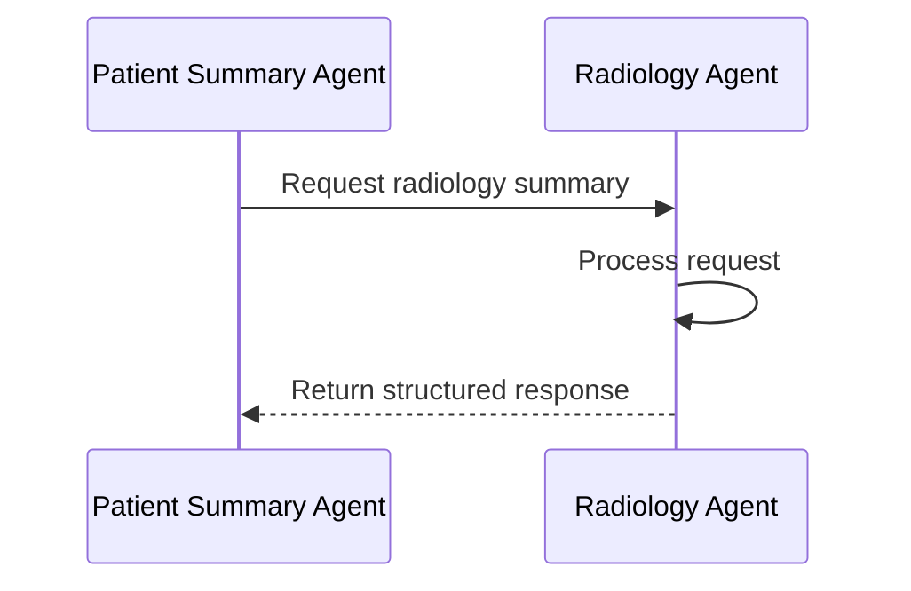
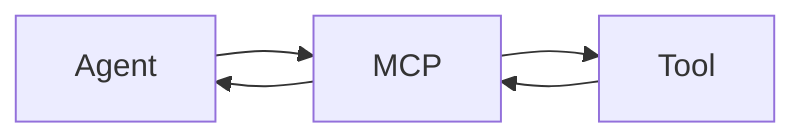
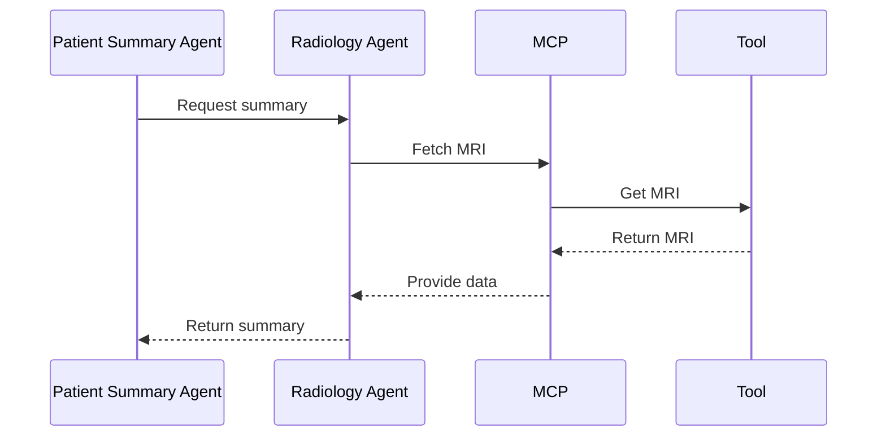

# Designing Agent-to-Agent (A2A) Communication and Model Context Protocol (MCP) for Scalable Healthcare AI Systems

## 1. Introduction: From Agents to Distributed Intelligence

In the previous blog, we explored the concept of agents and their role in healthcare AI systems. Agents are autonomous entities capable of performing specific tasks, such as summarizing patient data or analyzing radiology images. However, the real power of agents emerges when they collaborate. This blog focuses on how agents communicate and work together to form distributed intelligence.

The key question we address is: **How do these agents actually communicate and work together?**

---

## 2. The Core Problem in Multi-Agent Systems

Building multi-agent systems is challenging due to:

- **Tight Coupling**: Hardcoded integrations between agents make the system brittle.
- **Hardcoded Integrations**: Changes in one agent often require changes in others.
- **Data Access Inconsistencies**: Agents accessing each other's data directly can lead to conflicts.
- **Scaling Issues**: Monolithic designs hinder scalability.

To overcome these challenges, we need structured, contract-driven communication between agents.

---

## 3. What is Agent-to-Agent Communication (A2A)?

**Agent-to-Agent Communication (A2A)** is a structured, contract-driven approach where agents interact via well-defined interfaces. Key principles include:

- **Capability Exposure**: Agents expose their capabilities as services.
- **No Direct Data Access**: Agents do not directly access each other's data.
- **Interface-Driven Communication**: All interactions occur through well-defined APIs.

---

## 4. A2A Communication Design

### 4.1 Request Schema Design

```json
{
  "request_id": "uuid",
  "source_agent": "patient_summary_agent",
  "target_agent": "radiology_agent",
  "patient_id": "123",
  "context": {
    "priority": "high",
    "request_type": "summary"
  }
}
```

**Explanation:**
- `request_id`: Unique identifier for the request.
- `source_agent`: The agent initiating the request.
- `target_agent`: The agent receiving the request.
- `patient_id`: Identifier for the patient.
- `context`: Additional metadata, such as priority and request type.

### 4.2 Response Schema Design

```json
{
  "request_id": "uuid",
  "status": "success",
  "data": {
    "summary": "No significant progression detected"
  },
  "confidence": 0.92
}
```

**Explanation:**
- `request_id`: Matches the request ID for correlation.
- `status`: Indicates success or failure.
- `data`: Contains the response payload.
- `confidence`: Confidence score for the response.

---

## 5. A2A Execution Flow (Step-by-Step)



**Explanation:**
1. The Patient Summary Agent sends a request to the Radiology Agent.
2. The Radiology Agent processes the request.
3. The Radiology Agent returns a structured response.

---

## 6. Delegation and Chaining

In complex workflows, agents delegate tasks to other agents, forming multi-hop workflows. For example:

- **Patient Summary Agent → Radiology Agent → Comparison Agent**

This chaining enables modular and scalable workflows.

---

## 7. Introduction to MCP (Model Context Protocol)

The **Model Context Protocol (MCP)** is a standard interface for tools, data, and models. MCP ensures that agents do not directly query databases or APIs. Instead, they interact with an abstraction layer.

---

## 8. MCP Design

### 8.1 Tool Invocation Schema

```json
{
  "tool_name": "get_patient_mri",
  "parameters": {
    "patient_id": "123",
    "date": "latest"
  }
}
```

### 8.2 Tool Response Schema

```json
{
  "status": "success",
  "data": {
    "image_url": "s3://bucket/mri_scan.dcm"
  }
}
```

---

## 9. MCP Execution Flow



**Explanation:**
1. The agent sends a request to MCP.
2. MCP invokes the appropriate tool.
3. The tool processes the request and returns data to MCP.
4. MCP sends the data back to the agent.

---

## 10. Putting It Together: A2A + MCP Combined Flow



**Explanation:**
This diagram illustrates the entire lifecycle of a request, from initiation to completion.

---

## 11. Design Patterns

### Request-Response Pattern

Agents communicate via structured requests and responses.

### Delegation Pattern

Agents delegate tasks to other agents.

### Fan-out (Parallel Calls)

Agents make parallel calls to multiple agents.

### Aggregation Pattern

Agents aggregate responses from multiple agents.

---

## 12. Production Considerations

### Timeout Handling

Set timeouts for requests to prevent blocking.

### Retry Logic

Implement retries for transient failures.

### Partial Failures

Handle partial failures gracefully.

### Observability

Include logging and tracing for debugging.

### Security

Authenticate and authorize all agent interactions.

---

## 13. Why This Architecture Scales

- **Loose Coupling**: Agents interact via well-defined interfaces.
- **Tool Abstraction**: MCP decouples agents from tools.
- **Independent Scaling**: Agents can scale independently.
- **Extensibility**: New agents and tools can be added easily.

---

## 14. Closing

Agent-to-Agent Communication (A2A) and the Model Context Protocol (MCP) form the foundation of scalable healthcare AI systems. By combining these approaches, we can build modular, extensible, and production-ready systems.

**In the next blog, we will apply these concepts to a real-world department-level implementation, starting with Radiology.**