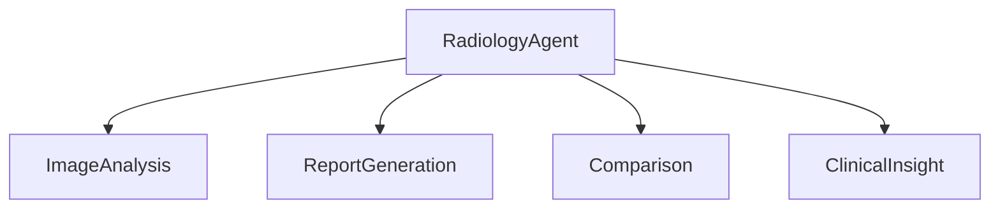
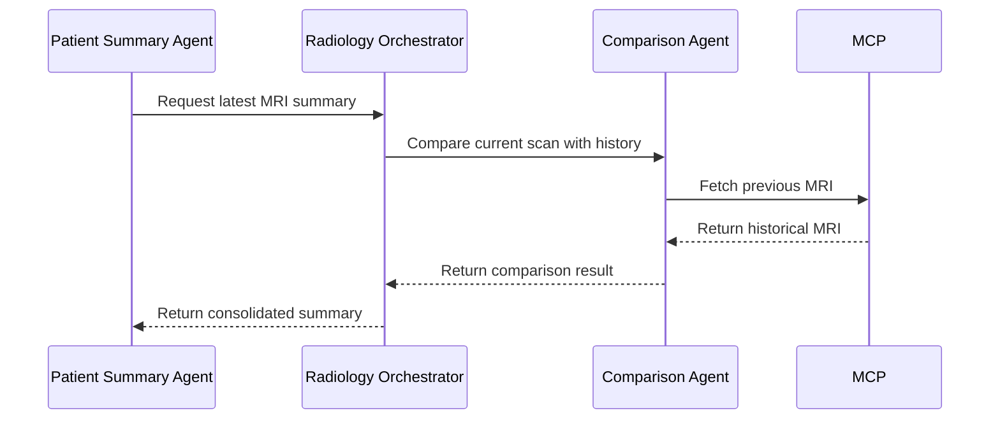

# Building Agentic AI for Radiology: A Deep Dive into Department-Level Implementation

## 1. Introduction

In the previous blogs, we introduced the concepts of agents, Agent-to-Agent Communication (A2A), and the Model Context Protocol (MCP). These foundational elements enable scalable, modular, and intelligent healthcare AI systems. Radiology is an ideal first use case for implementing Agentic AI due to its complexity and critical role in patient care. Radiology departments handle diverse imaging modalities (MRI, CT, X-Ray), require historical comparisons, and generate actionable insights for clinicians.

This blog provides a detailed, implementation-ready guide to building Agentic AI for a Radiology department. We will explore the architecture, agent responsibilities, workflows, and scalability considerations.

---

## 2. Radiology Agents Overview

The Radiology department's AI system is composed of the following agents:

- **Radiology Orchestrator Agent**: Coordinates all sub-agents and manages workflows.
- **Image Analysis Agent**: Detects lesions, abnormalities, and other findings in medical images.
- **Report Generation Agent**: Creates structured radiology reports.
- **Comparison Agent**: Compares new scans with historical scans to detect changes.
- **Clinical Insight Agent**: Converts findings into actionable insights for clinicians.

### Agent Hierarchy



---

## 3. Detailed Agent Responsibilities

### Radiology Orchestrator Agent

- **Purpose**: Manages workflows and delegates tasks to sub-agents.
- **Inputs**: Patient ID, scan type, priority.
- **Outputs**: Consolidated radiology summary.
- **A2A Calls**: Communicates with all sub-agents.
- **MCP Calls**: Fetches patient data and imaging metadata.

### Image Analysis Agent

- **Purpose**: Analyzes medical images to detect abnormalities.
- **Inputs**: Imaging data (e.g., MRI, CT).
- **Outputs**: Detected findings (e.g., lesions, fractures).
- **A2A Calls**: None (standalone).
- **MCP Calls**: Fetches imaging data.

### Report Generation Agent

- **Purpose**: Generates structured radiology reports.
- **Inputs**: Findings from Image Analysis Agent.
- **Outputs**: Structured report in JSON format.
- **A2A Calls**: Receives findings from Image Analysis Agent.
- **MCP Calls**: None.

### Comparison Agent

- **Purpose**: Compares new scans with historical scans.
- **Inputs**: Current and historical imaging data.
- **Outputs**: Comparison summary (e.g., lesion growth).
- **A2A Calls**: Communicates with Radiology Orchestrator Agent.
- **MCP Calls**: Fetches historical imaging data.

#### Example Workflow

1. **Input**: Current MRI scan.
2. **Action**: Fetch prior MRI scans via MCP.
3. **Compare**: Detect lesion growth or shrinkage.
4. **Output**: Structured comparison summary.

### Clinical Insight Agent

- **Purpose**: Converts findings into actionable insights.
- **Inputs**: Findings and comparison summaries.
- **Outputs**: Clinical recommendations.
- **A2A Calls**: Communicates with Radiology Orchestrator Agent.
- **MCP Calls**: Fetches clinical guidelines.

---

## 4. Agent-to-Agent (A2A) in Radiology

### Communication Patterns

- **Request-Response**: Agents request data or actions from other agents.
- **Delegation**: Agents delegate tasks to sub-agents.
- **Chaining**: Multi-hop workflows where agents call other agents.

### Sequence Diagram



**Step-by-Step Explanation**:
1. The Patient Summary Agent requests a radiology summary from the Radiology Orchestrator.
2. The Radiology Orchestrator delegates the comparison task to the Comparison Agent.
3. The Comparison Agent fetches historical MRI data via MCP.
4. The MCP retrieves the data and returns it to the Comparison Agent.
5. The Comparison Agent generates a comparison summary and sends it to the Radiology Orchestrator.
6. The Radiology Orchestrator consolidates the results and returns the summary to the Patient Summary Agent.

---

## 5. Model Context Protocol (MCP) Usage

### Tool Invocation Schema

```json
{
  "tool_name": "get_mri_scan",
  "parameters": {
    "patient_id": "123",
    "scan_date": "latest"
  }
}
```

### Tool Response Schema

```json
{
  "status": "success",
  "data": {
    "image_url": "s3://bucket/mri_scan.dcm"
  }
}
```

---

## 6. Workflows and Examples

### Workflow 1: New Patient MRI

1. Radiology Orchestrator fetches the latest MRI scan.
2. Image Analysis Agent detects abnormalities.
3. Report Generation Agent creates a structured report.

### Workflow 2: Follow-up MRI with Historical Comparison

1. Radiology Orchestrator fetches the latest MRI scan.
2. Comparison Agent fetches historical scans and compares them.
3. Clinical Insight Agent generates actionable insights.

### Workflow 3: Critical Finding Escalation

1. Image Analysis Agent detects a critical abnormality.
2. Radiology Orchestrator escalates the finding to the Clinical Insight Agent.
3. Clinical Insight Agent generates an urgent recommendation.

---

## 7. Department-Level Low-Level Design (LLD)

### JSON Contracts

#### Radiology Orchestrator Agent

```json
{
  "inputs": {
    "patient_id": "string",
    "scan_type": "string",
    "priority": "string"
  },
  "outputs": {
    "summary": "string"
  },
  "capabilities": ["coordinate_agents", "manage_workflows"]
}
```

#### Image Analysis Agent

```json
{
  "inputs": {
    "image_data": "binary"
  },
  "outputs": {
    "findings": "array"
  },
  "capabilities": ["detect_abnormalities"]
}
```

---

## 8. Scalability & Modular Design

- **Parallel Execution**: Image Analysis and Report Generation can run in parallel.
- **Extensibility**: Adding new scan types (e.g., PET, Ultrasound) requires minimal changes.
- **Loose Coupling**: A2A and MCP ensure agents are loosely coupled and reusable.

---

## 9. Key Takeaways

- Department-level orchestration makes AI actionable.
- Agents are modular, extensible, and reusable.
- A2A + MCP provide a scalable intelligence layer.
- Radiology is a template for other departments.

---

## 10. Closing

Radiology is the perfect starting point for building Agentic AI systems. By leveraging A2A and MCP, we can create scalable, modular, and intelligent systems that transform healthcare. In the next blog, we will explore how these concepts can be applied to Pathology and Laboratory departments.